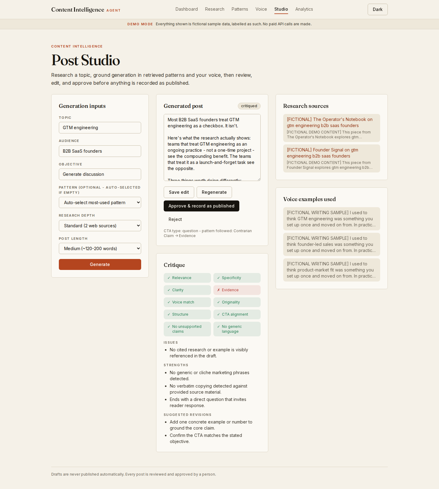
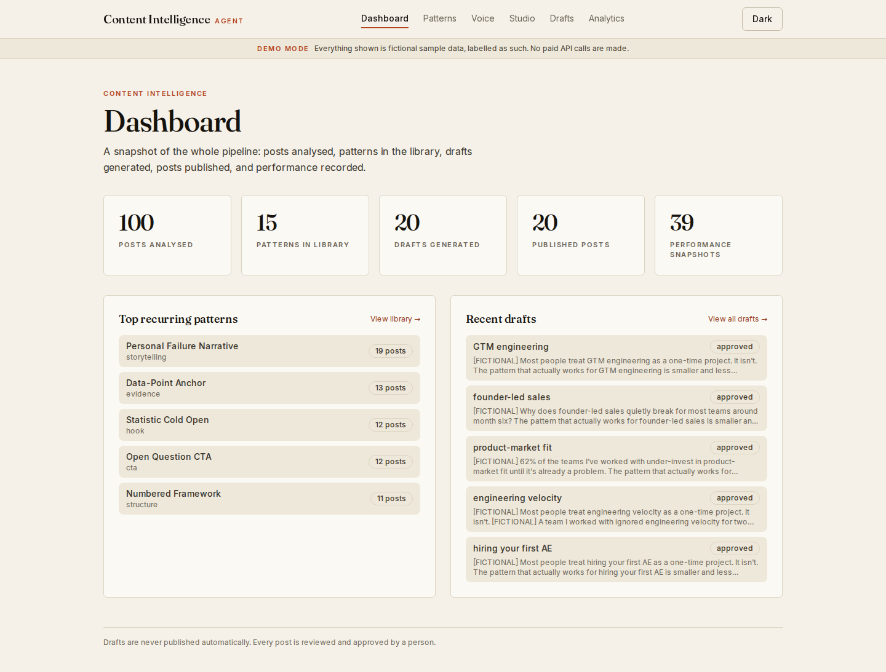
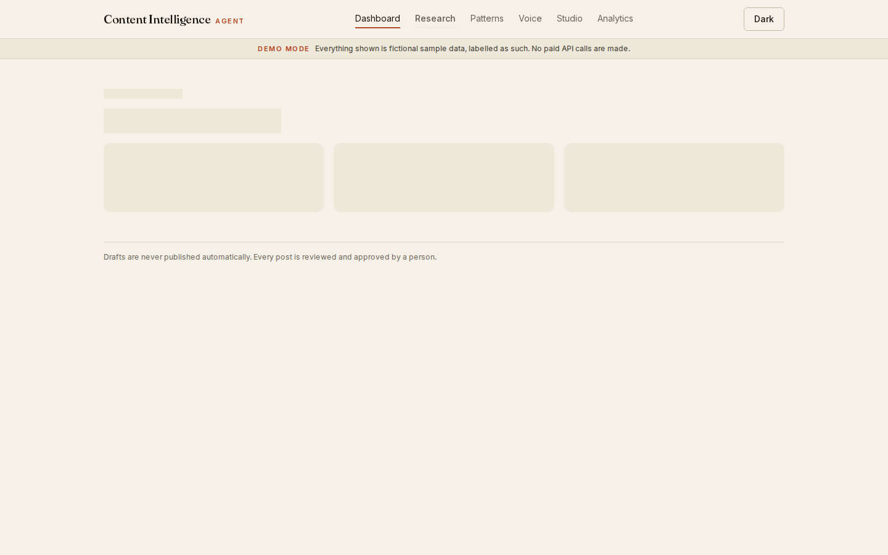
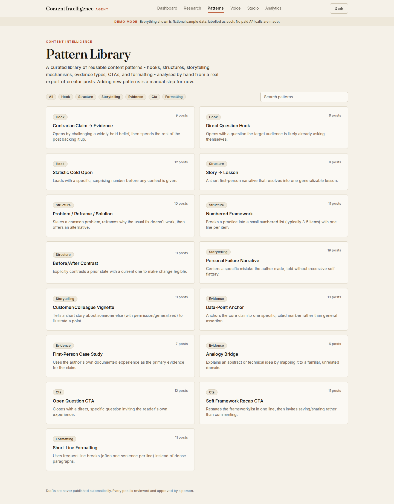
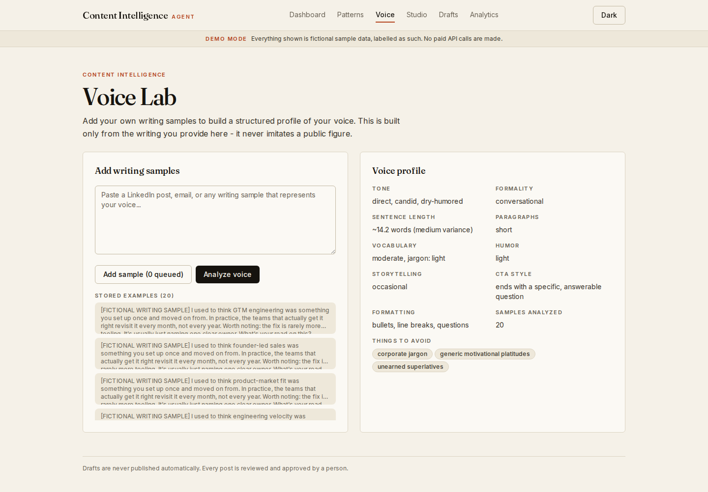
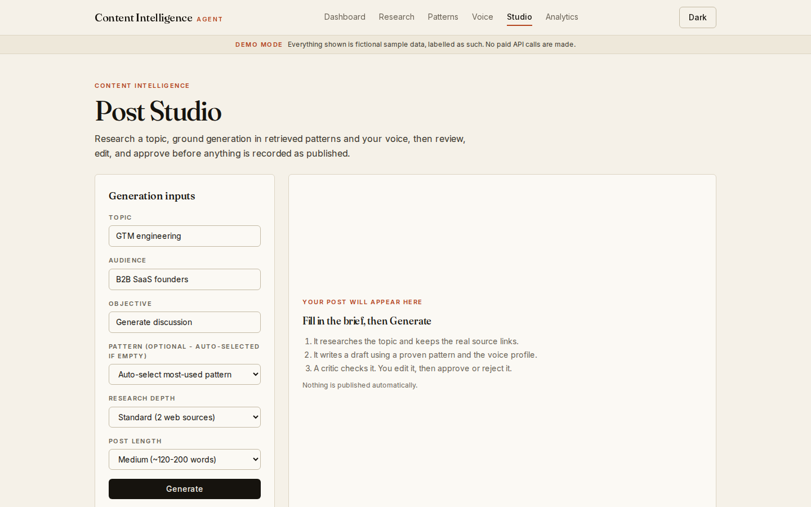
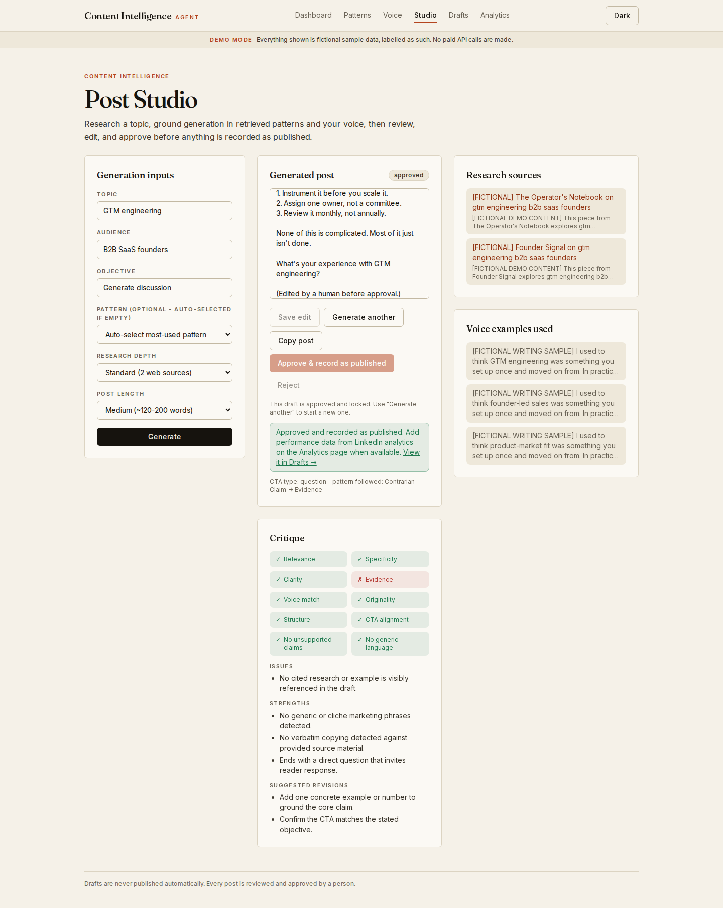
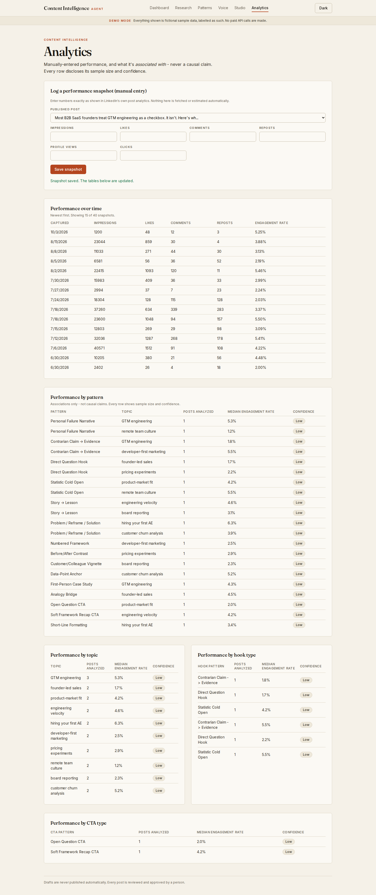
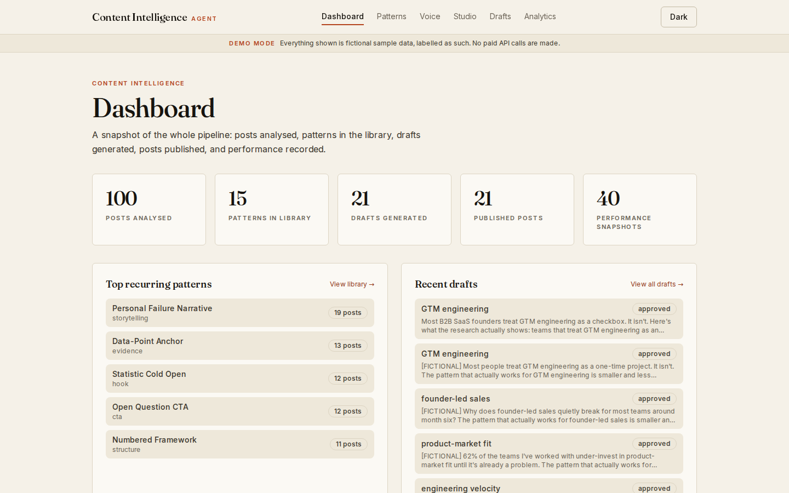

# LinkedIn Content Intelligence Agent

A research-grounded pipeline for writing LinkedIn posts. It is not a "type a topic, get a post" box.

It studies what works in real creator posts, writes in a plain voice, checks its own draft, and makes a human approve every post. Nothing is ever published automatically.



**Motion graphic (62 sec, silent):** [`docs/video/content-intelligence-agent.mp4`](docs/video/content-intelligence-agent.mp4). Rebuild it with `docs/video/render.js`.

> **Screenshots use demo mode.** Every record you see in them is fictional sample data and is labelled `[FICTIONAL]` or shown under a "Demo mode" banner. Demo mode makes no paid API calls and runs fully offline.

## What it does

```
creator posts  ->  pattern library  ->  voice profile
        topic research (web + Hacker News, real source links)
                          |
        generate  ->  critique  ->  human edit + approve
                          |
        record published  ->  enter results  ->  analytics  ->  better pattern choice
```

| Step | Screen | What happens |
|---|---|---|
| Research | `/research` | The creator posts the library is built from, with author, date and engagement. |
| Patterns | `/patterns` | A library of reusable hooks, structures, storytelling styles and CTAs, with examples. |
| Voice | `/voice` | A structured profile of a writing voice (tone, sentence length, formatting habits). |
| Studio | `/studio` | Pick a topic, audience and length. It researches, writes, and critiques. You edit, then approve or reject. |
| Analytics | `/analytics` | You enter real results from LinkedIn. It shows what performs, with sample size and confidence. |

### How a post is generated

1. **Research.** A web search plus recent Hacker News threads, always keeping the real source URL. Bot-check pages are skipped.
2. **Pattern.** One content pattern is chosen. Once a pattern has 3 or more of your recorded posts, the choice follows your own engagement. Before that, it follows how often creators used it.
3. **Models.** The three highest-engagement creator posts are shown to the model so it can learn hook, rhythm and structure. It is told not to copy them.
4. **Copywriting rules.** A plain-language prompt: short words, concrete details, no AI-sounding phrases, line length that fits the idea, no source tags in the post.
5. **Critique.** Deterministic checks (copying, cliches, unsupported numbers) plus a model review against named criteria. There is no single opaque score.
6. **Human review.** You edit, approve or reject. Approving records the post as published. Approve is safe to click twice.

## What is real and what is sample

- **Real end to end:** the Studio flow and manual performance entry.
- **Curated, not automatic:** the pattern library and the sample voice profile are loaded from hand-analysed data (`src/lib/data/real-gtm-patterns.ts`). The model-based pattern extraction in `src/lib/patterns/extract.ts` exists but nothing in the app triggers it yet.
- **Voice sample:** the shipped voice profile comes from one sample post written for this project. The Voice screen labels it as a sample. Add your own writing to replace it.
- **Creator posts:** public posts from a manual export, shown with attribution and a link. This app does not scrape LinkedIn. They are used here for analysis and as style references, not republished as new posts.
- **Metrics:** never fetched or estimated. Every number in Analytics is typed in by a person.

## Run it

### Demo mode (no keys, no database)

```bash
npm install
npm run dev
```

Open http://localhost:3000. With `DEMO_MODE` unset, development runs in demo mode: mock research, a mock model, and an in-memory store with labelled fictional data.

### Real mode

1. Copy `.env.example` to `.env.local` and set `DEMO_MODE=false`.
2. **Database (Supabase):** create a project, enable the `vector` extension, then run `supabase/migrations/0001_init.sql` in the SQL Editor. Also run `0002_security_and_integrity.sql` (recommended): it turns on Row Level Security and prevents duplicate records.
3. **Model:** set `AI_PROVIDER` and its key. Supported: `google`, `modal` (your own endpoint), `nvidia`, `openrouter`, `anthropic`, `openai`. With `AI_PROVIDER=modal` and an `NVIDIA_API_KEY`, NVIDIA is used as a backup.
4. **Research:** `RESEARCH_PROVIDER` (`seo-pipeline`, `serpapi` or `firecrawl`) and its settings.
5. **Background jobs:** generation runs as a Trigger.dev job so it can take minutes. Set `TRIGGER_SECRET_KEY` and `TRIGGER_PROJECT_ID`. The job needs its own copy of the model, database and `DEMO_MODE` variables in the Trigger.dev dashboard (Production). A GitHub Action (`.github/workflows/trigger-deploy.yml`) deploys the job on every change under `src/`; it needs a `TRIGGER_ACCESS_TOKEN` repository secret.
6. **Password (optional):** set `APP_PASSWORD` and the whole app asks for it (browser login box, any username). Left empty, the app is open. That is fine for a sample-data demo, but anyone with the link can then run the model, so set it before sharing a link that has real keys behind it.
7. **Sample data:** with `SEED_ADMIN_TOKEN` set, call `/api/admin/seed-real-patterns` and `/api/admin/seed-real-voice` once (add `?token=...`). `/api/admin/env-check` and `/api/admin/data-check` report what the server can see, without showing secrets.

## Commands

```bash
npm run dev         # development server
npm run build       # production build
npm start           # serve the production build
npm test            # Vitest suite
npm run typecheck   # tsc --noEmit
npm run lint        # ESLint
```

## Stack

Next.js 14 (App Router) · TypeScript · Tailwind · Supabase Postgres · Trigger.dev v4 · Zod · Vitest. Models are behind one interface (`AIProvider`) so a vendor can be swapped without touching the pipeline. Structured output is validated with Zod and retried once with the error fed back.

## Project structure

```
src/
  app/                 pages (dashboard, research, patterns, voice, studio, analytics) + API routes
  middleware.ts        password gate for pages and API
  lib/
    ai/                provider interface, vendors, fallback chain, structured-output validation
    research/          search + scrape providers, Hacker News, orchestration
    generation/        context, generator (copywriting prompt), pipeline, pattern selection
    critic/            deterministic checks + model review
    performance/       engagement math and per-pattern aggregation
    data/              repository (Supabase or in-memory demo store), seed data, draft rules
    security/          password check, rate limit, public-URL checks
  trigger/             Trigger.dev background job(s)
supabase/migrations/   schema + security/integrity migration
tests/                 unit tests (96)
docs/                  per-layer docs, audit, demo walkthrough, screenshots
```

## Security notes

- Optional password gate (`APP_PASSWORD`) on every page and API route; rate limit on the paid routes (10 per 10 minutes per caller; per server instance, so best-effort on serverless). **With no password set, the app is open.**
- Row Level Security and duplicate protection come from migration `0002`, which is recommended but optional for a demo. If you have not run it, the public Supabase key can read and write the tables. The server uses the service-role key, which bypasses RLS.
- `sourceUrls` accepts only public http(s) addresses. Redirects, timeouts and size are checked on direct fetches. A public domain that secretly points to a private address is not caught.
- Admin routes always need `SEED_ADMIN_TOKEN` (and the app password too, if one is set).
- No secrets are stored in the repository.

## Known limitations

See [`docs/audit.md`](docs/audit.md) for the full list. The main ones that remain:

- Pattern extraction from new posts is manual for now.
- Research quality depends on the search provider. Some pages are thin, and Hacker News items add little detail.
- The voice profile needs your own writing to be meaningful.
- A model critic can still miss claims that are not numbers.
- Rate limiting and URL checks have the limits described above.

## Documentation

- [`docs/demo-walkthrough.md`](docs/demo-walkthrough.md) - a 3 to 5 minute walkthrough script
- [`docs/audit.md`](docs/audit.md) - engineering audit of the system
- [`docs/architecture.md`](docs/architecture.md), [`docs/research-system.md`](docs/research-system.md), [`docs/pattern-library.md`](docs/pattern-library.md), [`docs/voice-model.md`](docs/voice-model.md), [`docs/generation.md`](docs/generation.md), [`docs/feedback-loop.md`](docs/feedback-loop.md) - deeper notes per layer (written earlier; where they differ from this README, this README is current)

## Screenshots

| | |
|---|---|
|  Dashboard |  Research |
|  Patterns |  Voice |
|  Studio, before generating |  After approval |
|  Analytics |  Dark theme |
